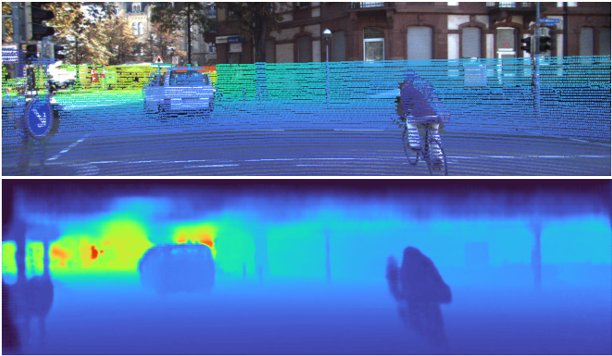

# Deep Learning based Real-time capable Depth Completion

This repository contains the code for various pretrained neural networks that can create dense depth images based on a pair of RGB- and sparse depth images (the sparse depth image is created from LiDAR pointcloud).
All networks were trained with the KITTI dataset for 2 epochs without stereoimages (43.000 datapairs per epoch).

# Installation and build

The code was developed an tested on **Linux Ubuntu 20.04** in combination with **python 3.8**

## 1. Install necessary python 3 packages from the file *requirements.txt:*

* Go to the folder with the downloaded repository
* Install necessary packages: `pip install -r requirements.txt`

## 2. Download the pretrained networks

* https://drive.google.com/drive/folders/17cHob0D2pWDDSc8jJ8sYvuHlhRr_VOam?usp=sharing
Download the pretrained weights here: [Weights](https://drive.google.com/drive/folders/17cHob0D2pWDDSc8jJ8sYvuHlhRr_VOam?usp=sharingGo) 
Save them to a folder called *Trained_Networks* and put this folder in the repository.

## 3. Download Kitti Dataset

* Download KITTI raw & KITTI depth dataset (Both datasets are also stored on the FTM *Perception_datasets* drive).
* Go to the *params.py* file and adjust the paths for the variables *dir_kitti_depth* and *dir_kitti_raw* according to the paths of datasets.

## 4. Select network for evaluation

* Based on three existing networks, various lightweight network variants were developed.
* The base networks are:
  * ENet (based on: https://github.com/JUGGHM/PENet_ICRA2021)
  * MSG-CHNet (based on: https://github.com/anglixjtu/msg_chn_wacv20)
  * PyD-Net2 (based on: https://github.com/ArnaudFickinger/PydNet-PyTorch)

    The original PyD-Net2 implementation was made for depth prediction. It therefore does originally not take the sparse depth into account and was adaopted for being capable for depth completion.
* Select the network you want to work with via the variable *selected_model* in the *params.py* file. Set this variable to the corresponding tagging in the column *Name* in the following table.

  | Network family | Changes  | Name  |
  | :---:   | :-: | :-: |
  | ENet | Like original network | ENet |
  | ENet | Implementation of depthwise separable convolutional layers | ENet_Netz_1 |
  | ENet | Implementation of depthwise separable convolutional layers, elimination of two conv layers per encoding step  | ENet_Netz_2 |
  | ENet | Implementation of depthwise separable convolutional layers, elimination of two conv layers per encoding step, reduction of encodng- / decoding-steps | ENet_Netz_3 |
  | ENet | Implementation of depthwise separable convolutional layers, elimination of two conv layers per encoding step, reduction of encoding- / decoding-steps, using 1/2 of number of channels | ENet_Netz_4 |
  | ENet | Implementation of depthwise separable convolutional layers, elimination of two conv layers per encoding step, reduction of encoding- / decoding-steps, using 1/4 of number of channels | ENet_Netz_5 |
  | ENet | Implementation of depthwise separable convolutional layers, elimination of two conv layers per encoding step, reduction of encoding- / decoding-steps, using 1/4 of number of channels, 3x3 kernels insted of 5x5 | ENet_Netz_6 |
  | ENet | Like ENet_Netz_6, but with 4 epochs of training | ENet_Netz_7 |
  | ENet | ENet with implemented Convolutional Block Attention Modules (CBAM) in both encoders (Attention Mechanism) | ENet_CBAM |
  | ENet | ENet with late datafusion --> first autoencoder has two encoders | ENet_late_Fusion |
  | ENet | ENet without Geofeatures | ENet_no_Geofeatures |
  | MSG-CHNet | Like original network 64 channels version | MSG_CHNet_64 |
  | MSG-CHNet | Like original network 32 channels version | MSG_CHNet_32 |
  | MSG-CHNet | 32 channels version, implementation of depthwise separable convolutional layers | MSG_CHNet_Netz_1 |
  | MSG-CHNet | 32 channels version, implementation of depthwise separable convolutional layers, elimination of first autoencoder | MSG_CHNet_Netz_2 |
  | MSG-CHNet | 32 channels version, implementation of depthwise separable convolutional layers, elimination of first and second autoencoder | MSG_CHNet_Netz_3 |
  | MSG-CHNet | 32 channels version, elimination of first and second autoencoder | MSG_CHNet_Netz_4 |
  | PyD-Net2 | Double amount of channels due to aditional sparse depth image | PyD_Net2_Netz_1 |
  | PyD-Net2 | Double amount of channels due to aditional sparse depth image, implementation of depthwise separable convolutional layers | PyD_Net2_Netz_2 |
  | PyD-Net2 | Original amount of channels due to aditional sparse depth image, implementation of depthwise separable convolutional layers | PyD_Net2_Netz_3 |
  | PyD-Net2 | Original amount of channels due to aditional sparse depth image, implementation of depthwise separable convolutional layers, reduction of encodng- / decoding-steps | PyD_Net2_Netz_4 |
  | PyD-Net2 | Original amount of channels due to aditional sparse depth image, implementation of depthwise separable convolutional layers, reduction of encodng- / decoding-steps, ReLU | PyD_Net2_Netz_5 |

## 5. Evaluation of the networks

* Adapt the variable *device* in the params.py file. Set it either to GPU ('cuda') or CPU ('cpu').
* Run the *evaluation.py* file to evaluate the runtime and the precision of the selected network. Results will be displayed in the shell.

## 6. Trainings of the networks

* Adapt the variable *device* in the params.py file. Set it either to GPU ('cuda') or CPU ('cpu').
* All attributes like learning rate, batch_size, weight decay etc. can be edited via variables in the *params.py* file.
* Run the *train.py* file to train the selected network on the kitti dataset.
* The weights of the trained network are safed every 50th training step. The name can be selected via the variable *name_saved_model* in the *params.py* file.

